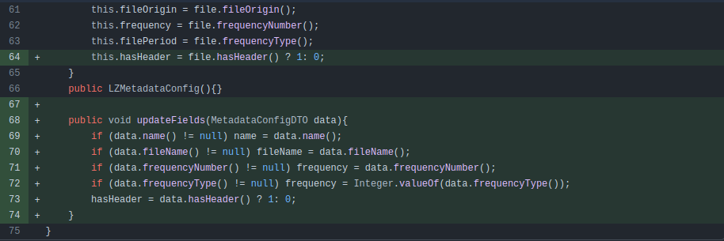
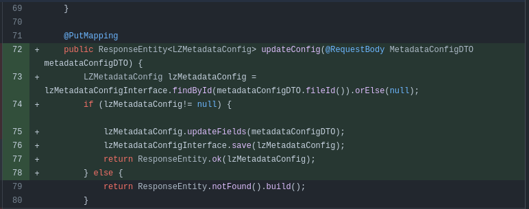
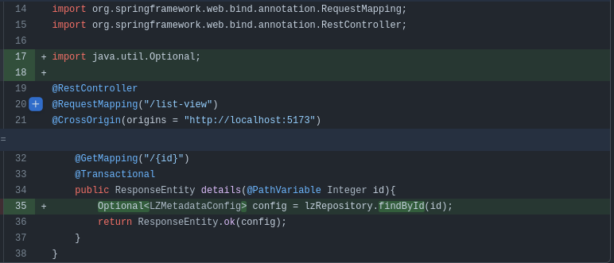
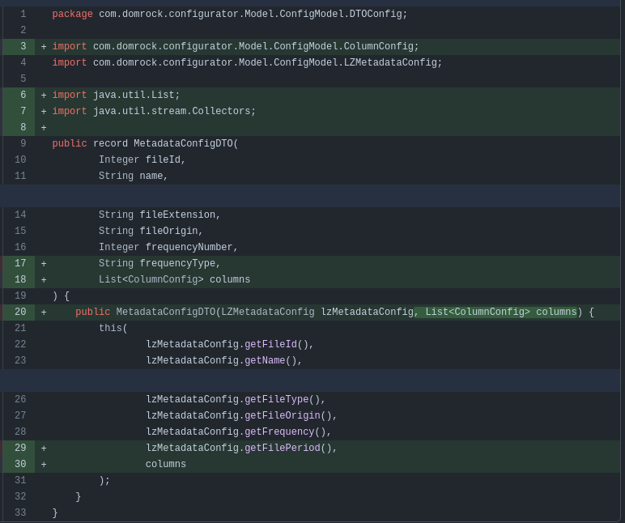
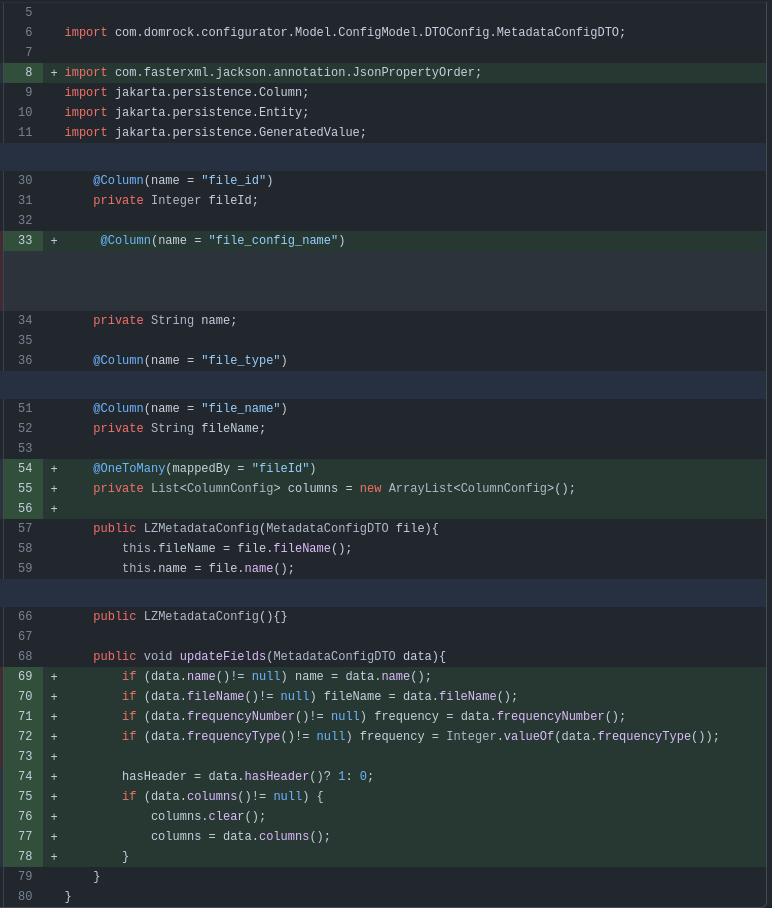
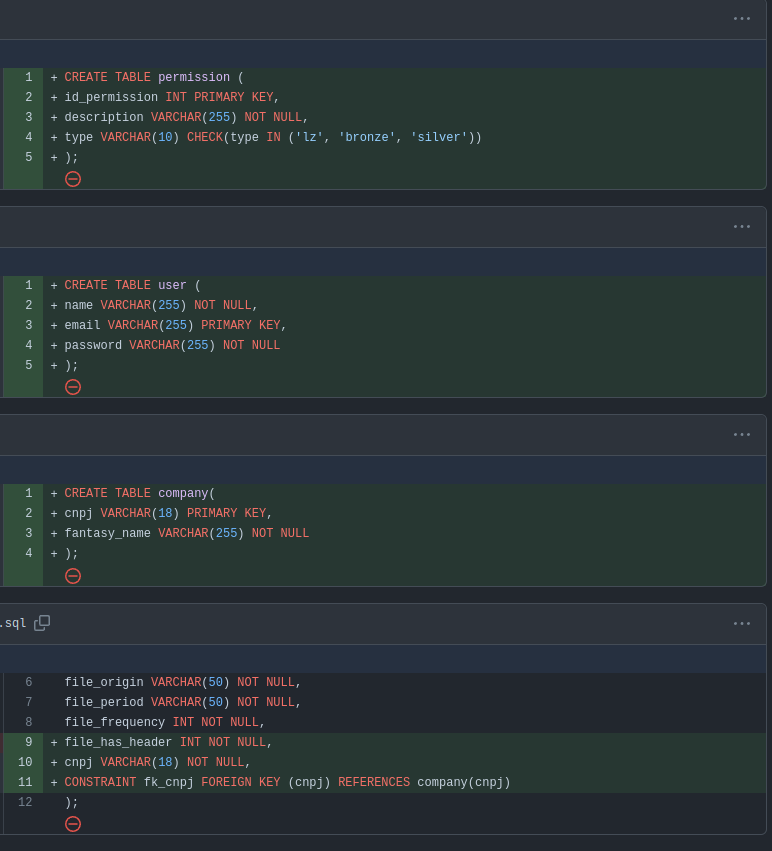

# Otavio Calderan Bruguel

## Introdução

Meu nome é Otavio Calderan, um desenvolvedor de sistemas, ingressei na Fatec no inicio de 2023, visando começar e
desenvolver minha carreira profissional na área de T.I. Ingressei no meu primeiro estágio em 04/2024 para trabalhar como
Cientista de Dados, lá aprendi muitas tecnologias para uso com IA, desenvolvimento Web/FullStack e manipulação de dados.

## Contatos

- [GIT](https://github.com/Otavio-CB)
- [LinkedIn](https://www.linkedin.com/in/otavio-calderan/)

## Meus Principais Conhecimentos

<!-- Apresente seus principais conhecimentos. Foque nos conhecimentos que possui maior domínio e que deseja desenvolver
durante sua carreira. -->

## Meus Projetos

### Em 2023-2

Mesmo formato

### Em 2023-8

Mesmo formato

### Em 2024-2

<!-- Fale sobre o projeto desenvolvido. Apresente a empresa parceira, o problema e a solução entregue pela equipe (mínimo de
um parágrafo por item). Recomenda-se o uso de figuras (ou até mesmo vídeos) para ilustrar os principais projetos. -->

A Dom Rock possui uma arquitetura de processamento de dados em cadeia chamada pipeline, que inclui vários estágios.
Esses estágios são orquestrados automaticamente com base nas características das fontes de dados e nas soluções de
algoritmos de IA ou modelos matemáticos, conforme as necessidades dos clientes. Durante a implantação da solução, é
necessário configurar as fontes de dados envolvidas para que a plataforma funcione corretamente. Atualmente, essa
configuração é feita manualmente, o que é um passo crítico e demorado para os técnicos. O desafio, portanto, é criar uma
interface amigável para facilitar essa configuração das fontes de dados.

[GIT - Dom Rock Pipeline](https://github.com/wiz-fatec/dom-rock-pipeline-configurator)

#### Tecnologias Utilizadas

<!-- Apresente brevemente as tecnologias utilizadas. Uma tecnologia por linha. Indique qual a importância de cada tecnologia
para o projeto. -->

1. **Java**  
   Linguagem de programação amplamente usada para desenvolvimento da aplicação, utilizado somente no backend. Foi
   importante para criar uma aplicação robusta e escalável.

2. **Spring**  
   Framework para desenvolvimento de aplicações Java, ofereceu suporte para injeção de dependências, gerenciamento de
   transações e criação de APIs REST. Facilitando a criação de aplicações web e microserviços.

3. **HTML**  
   HTML é uma linguagem de marcação utilizada na construção de páginas na Web.

4. **CSS**  
   Linguagem de estilo usada para descrever a apresentação de documentos HTML. Foi importante para estilizar e formatar
   páginas web, melhorando a aparência e a experiência do usuário.

5. **Vue.js**  
   Framework JavaScript para construção de interfaces de usuário interativas. Facilita a criação de aplicações web
   dinâmicas e reativas com uma arquitetura de componentes.

6. **MySQL**  
   Sistema de gerenciamento de banco de dados relacional. Crucial para armazenar e gerenciar dados de forma estruturada
   em aplicações web.

7. **Git**  
   Sistema de controle de versão distribuído. Essencial para rastrear mudanças no código-fonte e colaborar com outros
   desenvolvedores de forma eficiente.

8. **GitHub**  
   Plataforma de hospedagem para projetos que utilizam Git. Importante para o compartilhamento de código, colaboração e
   controle de versão em projetos de software.

9. **IntelliJ IDEA**  
   Ambiente de desenvolvimento integrado (IDE) para programação Java e outros idiomas. Facilita o desenvolvimento com
   suporte avançado para código, debugging e testes.

10. **WebStorm**  
    IDE da JetBrains focada em JavaScript, HTML e CSS. Ideal para o desenvolvimento de aplicações web modernas e
    front-end.

11. **Stack Overflow**  
    Plataforma de perguntas e respostas para desenvolvedores. Importante para obter suporte, resolver problemas e
    aprender com a comunidade de programadores.

 

#### Contribuições Pessoais

<!-- Apresente suas contribuições no projeto. Foque nas funcionalidades em que você mais atuou. Descreva sua atuação em
detalhes, especificando que tecnologias você utilizou. -->

Neste projeto atuei como FullStack, porém com maior participação no Frontend a partir da segunda sprint.

Adição das versões iniciais para o processamento de CSV e JSON e sua dependência

- Adição da dependência GSON ao projeto
- Realizada a manipulação do arquivo pom.xml para incluir a dependência GSON.
  A versão 2.10.1 da biblioteca GSON foi adicionada, permitindo a conversão de objetos Java para JSON e vice-versa.
  Esta modificação aprimora o projeto, fornecendo suporte robusto para serialização e deserialização de dados JSON, o
  que é essencial para a manipulação eficiente de dados no Spring Boot.

- Criados esboços iniciais das classes para processamento de dados CSV e JSON, localizadas no pacote com.domrock.utils.
- **CsvConverter**: Classe inicial para futuras implementações de conversão e processamento de arquivos CSV.
- **JsonConverter**: Classe que utiliza a biblioteca GSON para conversão de dados JSON.
- **JsonDataModel**: Classe dedicada à modelagem dos dados JSON que serão processados.
- **SendJson**: Classe que também utiliza GSON, possivelmente destinada ao envio ou manipulação de dados JSON.
- Essas adições preparam a base para o desenvolvimento das funcionalidades de conversão e processamento de dados,
  alinhadas com a arquitetura do projeto.

Adição do método de atualização de campos na classe LZMetadataConfig

Implementado o método updateFields na classe LZMetadataConfig, permitindo a atualização dos campos do objeto com base
nos dados fornecidos pelo MetadataConfigDTO.
O método realiza as seguintes atualizações:

- name e fileName são atualizados se os valores correspondentes no MetadataConfigDTO não forem nulos.
- frequency é atualizado com o valor de frequencyNumber ou convertido a partir de frequencyType.
- hasHeader é atualizado para 1 ou 0 dependendo do valor booleano em MetadataConfigDTO.
- Essas alterações aprimoram a classe, oferecendo maior flexibilidade para modificar os dados de configuração em tempo
  de execução.

Implementação do Método PUT para Atualização de Configurações

### 1. Método PUT para Atualização de Configurações

- **Rota:** `/list-view`
- **Método:** `updateConfig`
    - Implementado o método `updateConfig` com a anotação `@PutMapping`.
    - Recebe um objeto `MetadataConfigDTO` via `@RequestBody`.
    - Localiza a configuração correspondente usando o `fileId`.
    - Se encontrada, atualiza os campos com o método `updateFields` e salva a configuração no repositório.
    - Retorna um `ResponseEntity` com o objeto atualizado em caso de sucesso, ou `ResponseEntity.notFound()` em caso de
      falha.

  

Alteração no Método GET para Melhor Manipulação de Valores Nulos

### 2. Alteração no Método GET

- **Método:** `details`
    - Alterado o método de busca de `getReferenceById` para `findById`.
    - Uso de `Optional` para lidar com valores nulos.
    - Garantia de retorno adequado encapsulando o `Optional` em um `ResponseEntity`.

  

Atualização da Classe MetadataConfigDTO para Sincronizar Campos

### 3. Atualização da Classe MetadataConfigDTO

- **Classe:** `MetadataConfigDTO`
    - Atualizado o construtor da classe para refletir corretamente os campos da entidade `LZMetadataConfig`.
    - O construtor agora recebe um objeto `LZMetadataConfig` e uma lista de `ColumnConfig`, preenchendo os respectivos
      campos no DTO.

  

Aprimoramento do Método updateFields para Manipulação de Colunas

### 4. Aprimoramento do Método updateFields

- **Classe:** `LZMetadataConfig`
    - Estendido o método `updateFields` para incluir a atualização da lista `columns` caso presente no
      `MetadataConfigDTO`.
    - Limpeza da lista `columns` existente antes de atualizá-la com os novos valores, evitando redundâncias.

  

Criação das Tabelas de Empresa, Usuário e Permissão

### 1. Criação das Tabelas de Empresa, Usuário e Permissão

- **Tabela:** `permission`
    - Colunas criadas: `id_permission`, `description`, e `type`.
    - Restrição `CHECK` em `type`, limitando os valores a `'lz'`, `'bronze'`, ou `'silver'`.

- **Tabela:** `user`
    - Colunas criadas: `name`, `email`, e `password`.
    - `email` definido como chave primária.

- **Tabela:** `company`
    - Colunas criadas: `cnpj` e `fantasy_name`.
    - `cnpj` definido como chave primária.

Modificações na Tabela Existente de Arquivo

### 2. Modificações na Tabela Existente

- **Tabela:** `arquivo`
    - Adicionada a coluna `file_has_header` (do tipo `INT`), indicando se o arquivo possui cabeçalho.
    - Adicionada a coluna `cnpj` (do tipo `VARCHAR(18)`), associando o arquivo à tabela `company`.
    - Criada a restrição de chave estrangeira `fk_cnpj` para a coluna `cnpj`, referenciando a chave primária da tabela
      `company`.

  

Criação da Tela Silver

### 1. Estrutura do Componente

- **Componente:** `Silver`
    - Criado um novo componente Vue para a tela "Silver", utilizando TypeScript para tipagem forte.
    - Propriedades recebidas: `configList`, `tagInfo`, e `bronzeConfig`, configuradas no `defineProps`.

Implementação da Lógica de Navegação

### 2. Lógica de Navegação

- **Função:** `gotoSilverConfig`
    - Navega para a rota `/home` ao clicar em um dos botões de configuração.

Validação de Colunas no BConfig

### 3. Validação de Colunas

- **Função:** `validOrInvalid`
    - Desenvolvida para validar colunas dentro do `BConfig`, com parte do código comentada para futuras implementações.

Criação do Template e Estilo para a Tela Silver

### 4. Template e Estilo

- **Template:**
    - Estrutura de layout com um `div` principal que contém uma classe `container`, exibindo o título "Silver" e botões
      gerados dinamicamente a partir de `configList`.
    - Cada botão exibe o nome da configuração e chama `gotoSilverConfig` ao ser clicado.

- **Estilos:**
    - Definidos com SCSS, utilizando classes como `.grid-wrap`, `.banner`, `.invalid-tag`, e `.valid-tag` para
      personalizar a aparência.
    - Disposição dos elementos seguindo um grid layout flexível.

Integração de Componentes e Gerenciamento de Estado

### 5. Integração de Componentes e Modal

- **Componentes Importados:**
    - Componentes: `AppHeader`, `DRModal`, e `LVSilverContainer`, utilizados para compor a interface da tela "Silver".

- **Gerenciamento de Estado:**
    - Utilizadas referências (`ref`) para controlar a lista de configurações (`configList`), o estado do modal (
      `showModal`), e a configuração selecionada (`selectedConfig`).

Chamada de API para Atualização da Lista de Configurações

### 6. Chamada de API

- **Função Assíncrona:** `getConfig`
    - Realiza uma chamada `GET` para `http://localhost:8080/lz-config/list-view` e atualiza `configList` ao montar o
      componente.

Atualização do Alinhamento do Botão de Cadastro

1. Ajuste de Estilo para o Botão de Cadastro

- Modificação de Margem:
    - Ajustada a margem da classe saveButton, que contém o botão de cadastro (DRButton), para -80px, visando alinhar
      melhor o botão no layout.

- Estilização do Grid:
    - Mantida a estrutura de layout grid, com espaçamento definido por column-gap, para distribuir os elementos na tela
      de forma organizada.

- Estilo da Caixa de Seleção (checkBox):
    - A classe .checkBox foi mantida com display: flex e align-items: last baseline para garantir que os itens estejam
      alinhados na base inferior.
    - Direção dos itens dentro da checkBox definida como row e justificada para flex-start.

- **Estilo:** Escopado ao componente principal para garantir que as regras CSS sejam aplicadas apenas no contexto do
  componente "Silver".

Criação do Componente DonutChart

### 1. Criação do Componente DonutChart

- **Nova Dependência:**
- Adicionada a dependência `vue-chartjs` versão 5.3.1 ao projeto, permitindo a criação de gráficos no Vue 3.

- **Estrutura do Template:**
    - Criado o componente `DonutChart`, utilizando o gráfico de rosca (`Doughnut`) do `vue-chartjs`.
    - O gráfico é renderizado dentro de um contêiner (`chart-container`), que define a largura máxima e altura do
      gráfico.

- **Lógica do Script:**
    - Importados e registrados os elementos do `Chart.js` necessários para o gráfico de rosca: `Title`, `Tooltip`,
      `Legend`, `ArcElement`, e `CategoryScale`.
    - Definida a interface `ChartDataProps` para tipagem das propriedades recebidas (`labels`, `values`, `colors`,
      `title`).
    - Configurados os dados do gráfico (`chartData`) utilizando as propriedades recebidas via `defineProps`.
    - Definidas as opções do gráfico (`chartOptions`), focadas em responsividade, manutenção da proporção e estilização
      das legendas e título.

### 2. Modificação das Cores do Gráfico de Rosca

- **Alteração de Cores:**
    - As cores utilizadas no gráfico de rosca (`DonutChart`) foram atualizadas para uma nova paleta, garantindo maior
      contraste e diferenciação entre as seções do gráfico:
        - `#fa2e59` (Vermelho intenso)
        - `#ff703f` (Laranja)
        - `#f7bc05` (Amarelo)
        - `#ecf6bb` (Verde claro)
        - `#76bcad` (Verde azulado)

1. Ajuste de Estilo para o Botão de Cadastro

- Modificação de Margem:
    - Ajustada a margem da classe .saveButton, que contém o botão de cadastro (DRButton), para -80px, visando alinhar
      melhor o botão no layout.

- Estilização do Grid:
    - Mantida a estrutura de layout grid, com espaçamento definido por column-gap, para distribuir os elementos na tela
      de forma organizada.

- Estilo da Caixa de Seleção (checkBox):
    - A classe .checkBox foi mantida com display: flex e align-items: last baseline para garantir que os itens estejam
      alinhados na base inferior.
    - Direção dos itens dentro da checkBox definida como row e justificada para flex-start.

#### Hard Skills

<!-- Apresente as hard skills que você utilizou/desenvolveu durante o projeto e o nível de proficiência alcançado. Exemplo:
CSS - Sei fazer com autonomia -->

  
Programação Java - Sei fazer com consulta

- Desenvolvimento de aplicações backend robustas e escaláveis
- Utilização de recursos da linguagem, como collections, threads, e exceptions

  
Desenvolvimento com Spring Framework - Sei fazer com consulta

- Criação de APIs REST
- Injeção de dependências e gerenciamento de beans com Spring IoC Container
- Gerenciamento de transações e configuração de segurança com Spring Security
- Integração com bancos de dados usando Spring Data JPA

  
Estilização e Layout com CSS - Sei fazer com certa autonomia, mas preciso de consulta

- Design responsivo usando media queries
- Flexbox e Grid Layout para criação de layouts avançados
- Aplicação de animações e transições CSS
- Customização de temas e estilos para componente web

  
Desenvolvimento Frontend com Vue.js - Sei fazer com consulta

- Criação de componentes dinâmicos e reutilizáveis
- Gerenciamento de estado com Vuex
- Manipulação de eventos e ciclo de vida dos componentes
- Integração com APIs REST e manipulação de dados assíncronos

  
Gerenciamento de Bancos de Dados MySQL - Sei fazer com consulta

- Criação e manipulação de tabelas, índices e relações
- Escrita e otimização de consultas SQL complexas
- Gerenciamento de transações e controle de concorrência

  
Controle de Versão com Git - Sei utilizar com autonomia

- Gerenciamento de branches e fusão de código
- Resolução de conflitos de código durante o merge
- Uso de rebase para manter um histórico de commits limpo

  
Colaboração e Hospedagem de Projetos com GitHub - Sei utilizar com autonomia

- Criação e gestão de repositórios
- Revisão de código e pull requests

  
Desenvolvimento com IntelliJ IDEA - Sei utilizar com autonomia

- Navegação eficiente no código e refatoração automatizada
- Debugging avançado e uso de breakpoints condicionais
- Testes automatizados e integração com ferramentas de build como Maven ou Gradle
- Configuração de plugins e temas para personalização do ambiente

  
Desenvolvimento com WebStorm - Sei utilizar com autonomia

- Desenvolvimento frontend utilizando JavaScript, HTML e CSS
- Debugging e profilamento de código JavaScript
- Suporte a frameworks modernos como Vue.js e React
- Uso de ferramentas de build e task runners (Webpack, npm scripts)

  
Pesquisa e Resolução de Problemas com Stack Overflow - Sei utilizar com autonomia

- Busca de soluções para problemas específicos de programação
- Participação em discussões e compartilhamento de conhecimento
- Adaptação de soluções existentes para contextos específicos do projeto

#### Soft Skills

<!-- Apresente as soft skills que você utilizou/desenvolveu durante o projeto e em quais situações elas foram fundamentais.
Exemplo: Comunicação - Precisei exercitar minhas habilidades de comunicação para viabilizar as reuniões semanais levando
em conta as disponibilidades dos membros, que não cursavam as mesmas disciplinas. -->

Comunicação

- Em reuniões diárias e outras cerimônias, aprendi a expor minhas opiniões de forma clara e concisa, além de relatar o
  andamento das minhas tarefas de maneira que todos pudessem acompanhar o progresso. Essa prática me ajudou a construir
  uma comunicação mais assertiva e a colaborar de maneira mais eficaz com a equipe.

Trabalho em equipe

- Trabalhar em conjunto com colegas de diferentes áreas e perfis me ensinou a valorizar as contribuições de cada membro,
  a dividir responsabilidades e a construir soluções em conjunto, sempre visando o objetivo comum.

Adaptação à mudanças

- Em um projeto dinâmico, foi essencial adaptar-me rapidamente às mudanças de escopo, novas demandas e prazos apertados.
  Aprendi a ser flexível e a manter a calma mesmo em situações de pressão, o que foi crucial para manter a produtividade
  e a qualidade do trabalho.

Resolução de problemas

- Fui desafiado a encontrar soluções criativas para obstáculos inesperados, o que me levou a desenvolver uma abordagem
  mais analítica e a pensar fora da caixa para resolver problemas de forma eficaz e eficiente.

Gestão do tempo

- Com múltiplas tarefas e prazos para gerenciar, aprendi a priorizar atividades, organizar meu tempo de forma
  estratégica e entregar resultados consistentes dentro dos prazos estabelecidos.

### Em 2024-8

### Em 2025-2

### Em 2025-8

